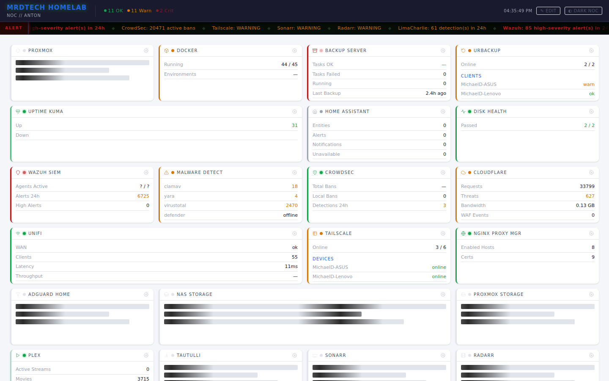
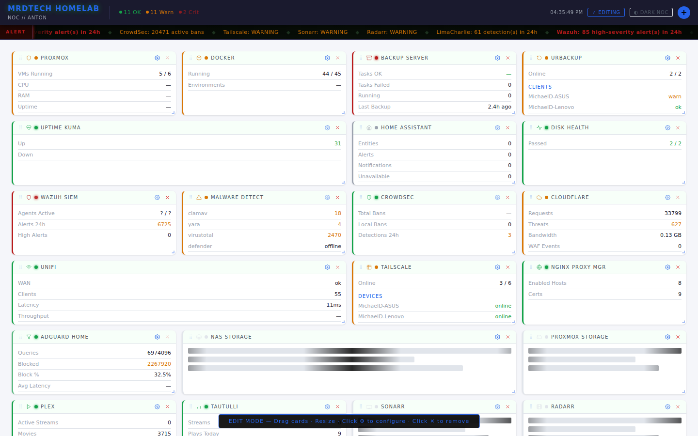
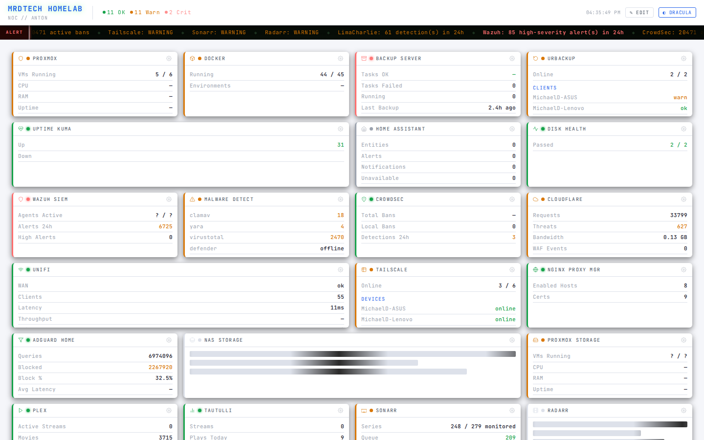

# NOC Dashboard v2

**An interactive, Homarr-inspired React + FastAPI homelab NOC dashboard with true dark-terminal aesthetic.**

Deploy it, load your credentials, and get a fully live NOC dashboard — drag cards around in edit mode, resize them, add or remove card types with a categorized picker, customize every card with a settings panel. Layout persists automatically.

---



*Dark NOC theme — true black background, green accents, terminal/NOC room aesthetic*

---



*Edit mode — drag handles, X remove buttons, gear settings highlighted, bottom banner*

---



*Light Clean theme — same live data, professional corporate look*

---

## Architecture

```
┌─────────────────────────────────────────────────────────┐
│                    Docker Container                     │
│                                                         │
│  ┌────────────────────────────────────────────────────┐ │
│  │  FastAPI (uvicorn) — server.py                     │ │
│  │                                                    │ │
│  │  /api/data/{card_type}  ← Python collectors        │ │
│  │  /api/layout            ← layout.json CRUD         │ │
│  │  /api/themes            ← YAML theme loader        │ │
│  │  /api/card-types        ← card registry + icons    │ │
│  │  /api/config            ← dashboard.yaml           │ │
│  │  /api/ticker            ← aggregated alert feed    │ │
│  │  /api/status-overview   ← ok/warn/crit counts      │ │
│  │  /api/events            ← SSE live card updates    │ │
│  │  /                      ← React SPA (static)       │ │
│  └────────────────────────────────────────────────────┘ │
│                                                         │
│  ┌────────────────────────────────────────────────────┐ │
│  │  React frontend (pre-built, served static)         │ │
│  │  • react-grid-layout (drag + resize)               │ │
│  │  • 27 card types, lazy-loaded chunks               │ │
│  │  • recharts sparklines + area + donuts             │ │
│  │  • 6 themes via CSS variables                      │ │
│  │  • SSE live updates — no page reloads              │ │
│  └────────────────────────────────────────────────────┘ │
└─────────────────────────────────────────────────────────┘
```

One container. One port (8081). No external databases.

---

## Features

### Visual Design — NOC Room Aesthetic
- **True black background** — `#0a0a0a`, not washed-out dark grey
- **Bright green accents** — `#00ff41` matrix green, with glow effects
- **Monospace everywhere** — JetBrains Mono / Fira Code / Consolas
- **Colored left stripe** on each card indicating status (green/yellow/red)
- **Status dots** on card headers with blink animation on critical
- **Section headers** in accent color, uppercase, small monospace font
- **Compact, information-dense cards** — no empty space

### Scrolling Ticker Bar
- Always-on scrolling info bar below the top bar (same pattern as NOC 1)
- Aggregates alerts and stats from all collectors into a live feed
- Color-coded by severity: critical (red), warning (amber), OK (green)
- ALERT badge pulses red when critical issues are present
- Auto-refreshes every 2 minutes with latest data

### Status Overview
- Next to the title: **"11 OK · 11 Warn · 2 Crit"** with colored dots
- One-glance health of the entire monitored environment
- Updates every 30 seconds from `/api/status-overview`

### Edit Mode — Homarr-Inspired
- **Clean view mode** by default — cards look polished, no visual clutter
- Click **✎ EDIT** in the top bar to enter edit mode:
  - Drag handles appear on card headers
  - Cards become draggable and resizable
  - ⚙ gear icon highlighted in accent color
  - ✕ remove button visible on each card
  - **+** Add Card button appears in the top bar
  - Bottom banner reminds you edit mode is active
- Click **✓ EDITING** to exit — layout auto-saves

### Add Card Panel
- **Categorized grid** of all 27 card types: Infrastructure, Security, Network, Storage, Media, Monitoring
- Each card type shows its icon, label, and description
- Category tabs for filtering + global search
- Click any card type to add it to the dashboard

### Card Settings Panel
- **Title** — custom label
- **Icon picker** — 25 curated icons (Server, Shield, Cloud, Database, Film, etc.)
- **Graph toggle** — on/off
- **Graph type** — Sparkline, Area, Gauge, Donut
- **Graph color** — color picker + hex input
- **Refresh interval** — per-card polling rate in seconds
- **Thresholds** — JSON warn/crit values
- **Notes** — free text notes about the card
- **Remove** — with two-step confirmation

### Live Updates via SSE
- `/api/events` Server-Sent Events stream pushes card data as collectors complete
- Cards update individually on their refresh cycle — the page never flashes
- SSE auto-reconnects after disconnect (5s backoff)

### 27 Card Types
- **Infrastructure**: Proxmox, Proxmox Storage, Docker/Portainer, PBS, URBackup, Home Assistant, Disk Health
- **Security**: Wazuh SIEM, CrowdSec, Cloudflare WAF, Malware Detect, LimaCharlie
- **Network**: UniFi, WAN Health, Tailscale, Nginx Proxy Manager, AdGuard Home
- **Storage**: QNAP NAS
- **Media**: Plex, Tautulli, Sonarr, Radarr, Prowlarr, SABnzbd, Overseerr
- **Monitoring**: Uptime Kuma, Custom URL

### 6 Themes
| Theme | Style |
|-------|-------|
| `dark-noc` | True black `#0a0a0a` + matrix green — default night |
| `light-clean` | White + blue — professional corporate |
| `midnight-blue` | Deep navy + cyan |
| `solarized-dark` | Classic solarized palette |
| `dracula` | Purple + pink + green |
| `nord` | Muted blues + arctic tones |

Auto day/night switching at configurable hours. Manual cycle button in top bar.

---

## Quick Start

### 1. Clone and configure

```bash
git clone https://github.com/mdziegiel/noc-dashboard.git
cd noc-dashboard
cp .env.example .env
# Edit .env with your real credentials
nano .env
```

### 2. Build and run

```bash
docker compose up -d --build
```

Open http://your-host:8081

The React app loads, fetches your layout from `state/layout.json` (bootstrapped from `dashboard.yaml` on first run), and starts polling the collectors. The SSE stream connects for live updates.

---

## Configuration

### .env

All service credentials. See `.env.example` for the full list. Every collector reads from this file — nothing is hardcoded.

```env
PROXMOX_HOST=10.10.10.251
PROXMOX_TOKEN_ID=root@pam!hermes
PROXMOX_TOKEN_SECRET=your-token-here
# ... etc
```

### dashboard.yaml

Top-level dashboard config: title, subtitle, theme defaults, auto-switch times, and an initial card layout that bootstraps `layout.json` on first run. After first run, drag-and-drop changes persist to `state/layout.json` directly.

```yaml
top_bar:
  title: "MRDTech NOC"
  subtitle: "Infrastructure Dashboard"

theme:
  preset: dark-noc
  auto_switch: true
  day_theme: light-clean
  night_theme: dark-noc
  day_start: "07:00"
  night_start: "19:00"

refresh_seconds: 60

sections:
  - title: Compute
    cards:
      - type: proxmox
        title: Proxmox
        size: wide   # normal | wide | tall | large
```

### Themes

Edit or add YAML files in `themes/`. Each file maps token names to CSS values. Themes are live-reloaded from the volume mount — no rebuild needed.

```yaml
# themes/my-custom.yaml
background: "#1a1a2e"
accent: "#e94560"
card_background: "#16213e"
# ... any token from THEME_DEFAULTS in server.py
```

---

## Card Types

| Type | Label | Category | Data Source |
|------|-------|----------|-------------|
| `proxmox` | Proxmox | Infrastructure | Proxmox API |
| `proxmox_storage` | Proxmox Storage | Infrastructure | Proxmox API |
| `docker` | Docker | Infrastructure | Portainer API |
| `pbs` | PBS | Infrastructure | PBS API |
| `urbackup` | URBackup | Infrastructure | URBackup API |
| `home_assistant` | Home Assistant | Infrastructure | HA REST API |
| `smart_health` | Disk Health | Infrastructure | Proxmox SMART |
| `wazuh` | Wazuh SIEM | Security | Wazuh API |
| `malware_sources` | Malware Detect | Security | Feed counts |
| `crowdsec` | CrowdSec | Security | CrowdSec LAPI |
| `cloudflare` | Cloudflare | Security | CF API |
| `limacharlie` | LimaCharlie | Security | LC REST API |
| `unifi` | UniFi | Network | UniFi API |
| `wan_health` | WAN Health | Network | UniFi API |
| `tailscale` | Tailscale | Network | Tailscale API |
| `nginx_proxy` | Nginx Proxy | Network | NPM API |
| `adguard` | AdGuard Home | Network | AdGuard API |
| `qnap` | NAS Storage | Storage | QNAP QTS API |
| `plex` | Plex | Media | Plex API |
| `tautulli` | Tautulli | Media | Tautulli API |
| `sonarr` | Sonarr | Media | Sonarr v3 API |
| `radarr` | Radarr | Media | Radarr v3 API |
| `prowlarr` | Prowlarr | Media | Prowlarr API |
| `sabnzbd` | SABnzbd | Media | SABnzbd API |
| `overseerr` | Overseerr | Media | Overseerr API |
| `uptime_kuma` | Uptime Kuma | Monitoring | Prometheus metrics |
| `custom_url` | Custom URL | Monitoring | Any JSON endpoint |

---

## API

The FastAPI backend is self-documenting. Swagger UI is at:

```
http://your-host:8081/api/docs
```

Key endpoints:

```
GET  /api/data/{card_type}   Run collector, return live JSON
GET  /api/layout             Current layout config
POST /api/layout             Save layout config
GET  /api/themes             All themes as CSS variable maps
GET  /api/card-types         Registry of all card types (with icon + category)
GET  /api/config             Dashboard title/subtitle
GET  /api/ticker             Aggregated alert/stats items for ticker bar
GET  /api/status-overview    Counts of ok/warn/crit across all cards
GET  /api/events             SSE stream for live card data pushes
GET  /api/health             Health check
```

---

## Development

```bash
# Backend (in project root)
uvicorn server:app --host 0.0.0.0 --port 8081 --reload

# Frontend (in frontend/)
npm run dev   # Vite dev server on :5173, proxies /api to :8081
```

---

## License

MIT — see [LICENSE](LICENSE).
