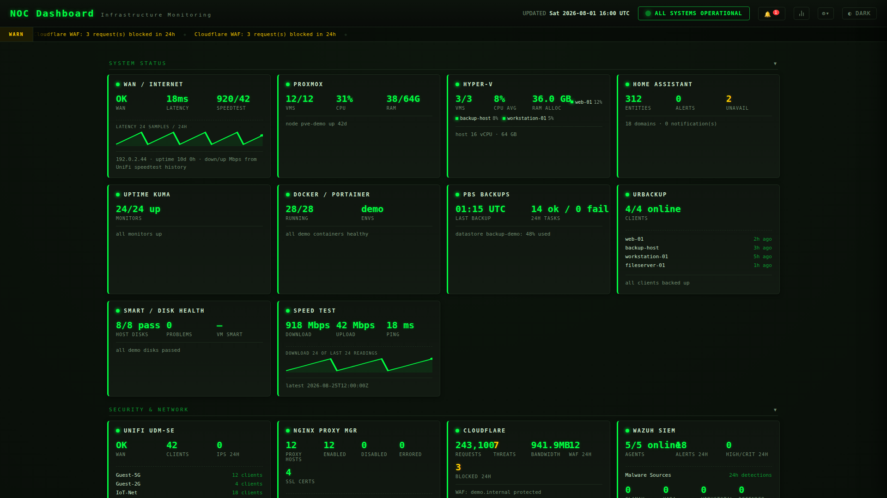
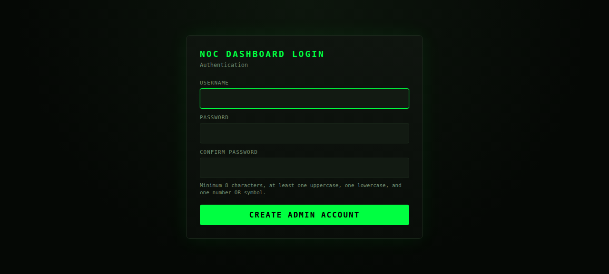
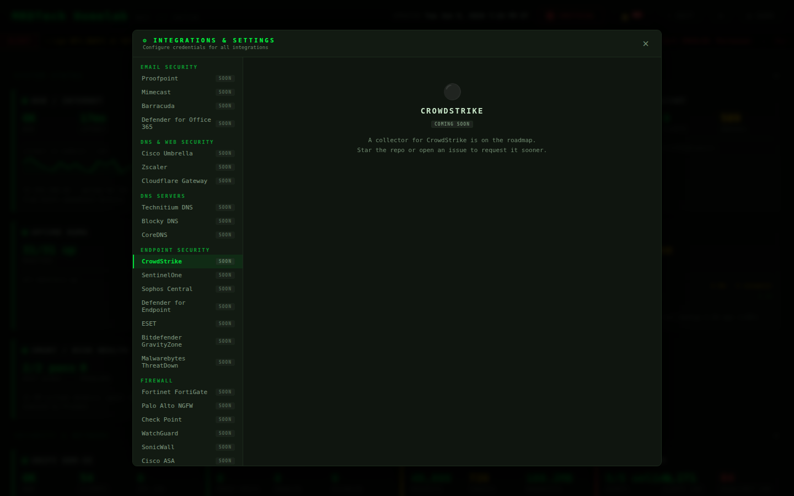
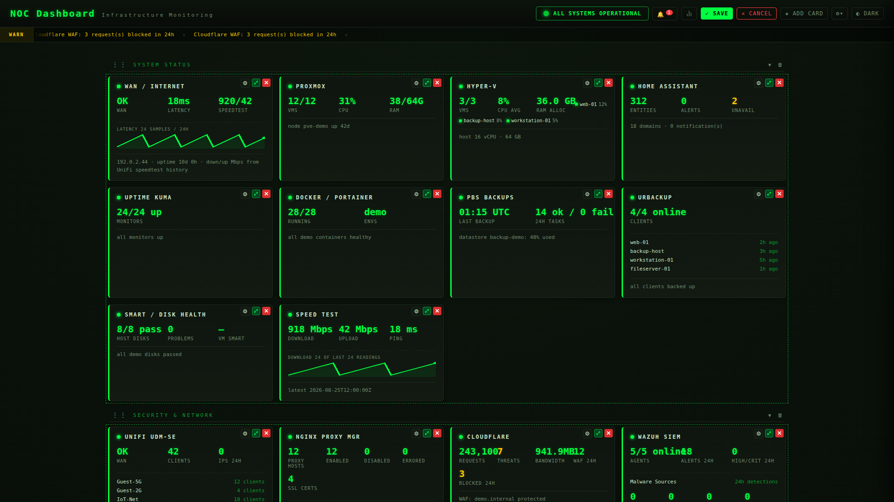
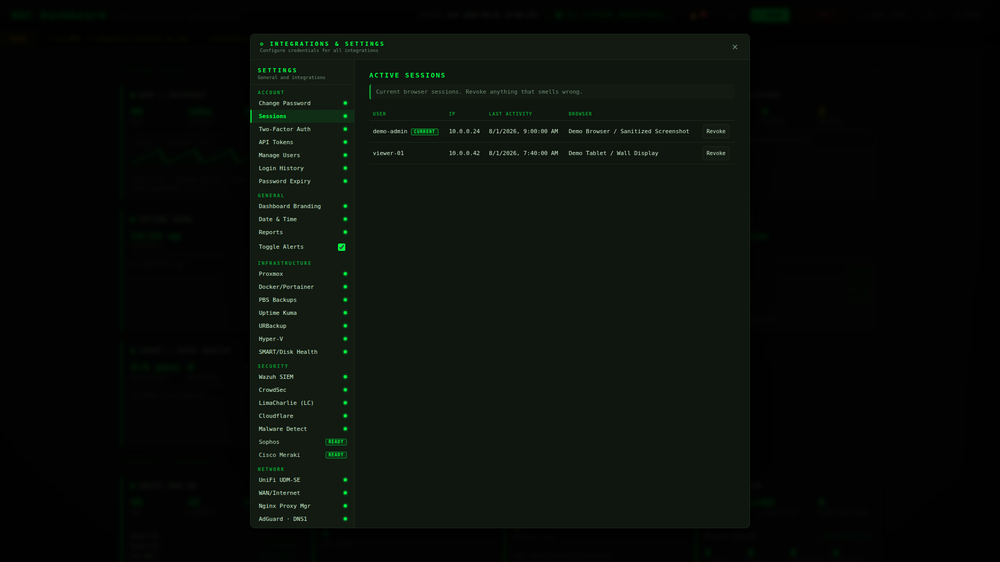

# NOC Dashboard

A self-hosted network operations center dashboard for homelabs. A single
Python service polls your infrastructure APIs, renders a static dashboard,
and serves it behind built-in multi-user authentication with TOTP 2FA.

No frameworks, no build step: the entire application is two Python files and
one external dependency (`bcrypt`). Everything else — HTTP server, TOTP
(RFC 6238), session management, HTML rendering — is implemented on the
standard library.



## Features

**Monitoring integrations** — Proxmox VE, Proxmox Backup Server, UniFi,
AdGuard Home, CrowdSec, Wazuh (manager + indexer), LimaCharlie, Portainer /
Docker, UrBackup, Uptime Kuma, QNAP, Hyper-V, Cloudflare, Tailscale,
WireGuard (WGDashboard), Nginx Proxy Manager, Home Assistant, SMART health,
media stack (Plex, Tautulli, Sonarr, Radarr, Prowlarr, SABnzbd, Overseerr),
malware-source intel, speed tests, and custom URL checks. Each integration
is configured through environment variables and appears as a card; anything
unconfigured is simply hidden.

**Authentication**
- Multi-user accounts with admin / viewer roles
- TOTP two-factor authentication (standard authenticator apps)
- Account lockout after 5 failed attempts, with admin unlock
- Forced password change and password aging
- Session management with per-session revocation
- bcrypt password hashing, HttpOnly session cookies

**Dashboard**
- Server-rendered static HTML — fast, no client framework
- Themes (`themes/`): dark NOC, Nord, Dracula, midnight blue, light, and more
- Configurable clock format, layout persisted in a state volume
- On-demand speed tests from the dashboard

## Quick start

```bash
git clone https://github.com/mdziegiel/noc-dashboard.git
cd noc-dashboard
cp .env.example .env    # fill in the integrations you use; leave the rest unset
docker compose up -d --build
```

Open `http://<host>:9900`. On first run you'll be prompted to create the
initial admin account; enable TOTP from account settings.

### Without Docker

```bash
pip install -r requirements.txt
PORT=8081 python server.py
```

## Configuration

All integration credentials come from environment variables — see
`.env.example` for the full list. The server periodically re-runs
`generate_dashboard.py` to refresh the rendered dashboard.

| Variable | Purpose | Default |
|---|---|---|
| `PORT` | HTTP listen port | `8081` |
| `NOC_STATE_DIR` | Users, sessions, layout, settings | `/app/state` |

State (user database, sessions, layout) lives in `NOC_STATE_DIR` — mount it
as a volume so accounts survive container rebuilds.

## Architecture

```
docker-compose.yml
 └─ server.py            stdlib ThreadingHTTPServer
     ├─ auth: bcrypt + TOTP + sessions   (/api/login, /api/users, /api/sessions)
     ├─ periodically invokes ↓
     └─ generate_dashboard.py            polls integration APIs, renders static
         └─ /app/output                  HTML served by server.py
```

## Security notes

This is designed for LAN / VPN use. If you expose it publicly, put it behind
a reverse proxy with TLS. All example addresses in this repository use the
RFC 5737 documentation range (`192.0.2.0/24`) — replace them with your own.

## Screenshots

| | |
|---|---|
|  |  |
|  |  |

## License

See [LICENSE](LICENSE).
